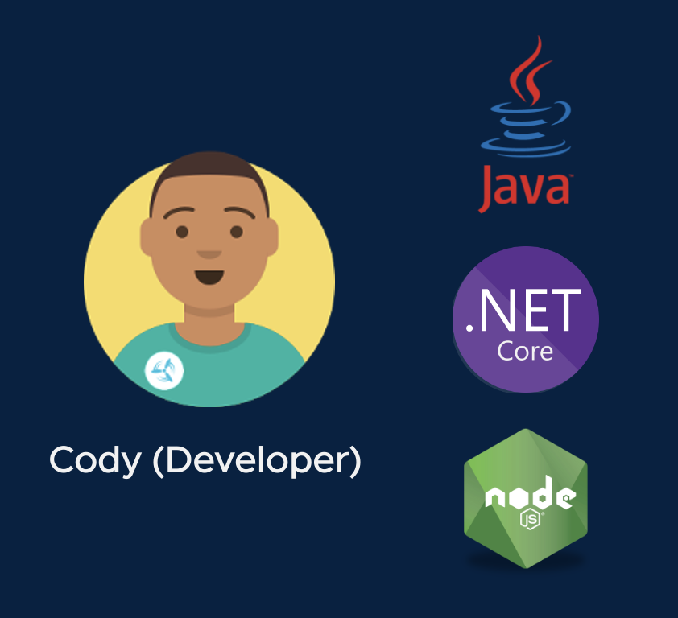

# Getting started with Tanzu Application Platform.

We're going to start our story with Cody, an application developer. He's not a deep expert on container infrastructure, but he's an absolute star in writing business applications using popular languages and frameworks.



When Cody joins an existing project, he will generally want to begin by achieving three things:

1. Download and install all the necessary components to edit, build, and run the project
1. Successfully build and package the current code base
1. Successfully deploy and run the application in the appropriate environment

But he's not sure where to begin. Fortunately, he has a partner in crime, in Alana. Alana is the DevOps guru who manages the Kubernetes environments that Cody wants to access, and she has deployed Tanzu Application Platform onto her clusters:


Alana tells our developer Cody to get started by logging into **Application Accelerator**.

**Application Accelerator for VMware Tanzu** is made to simplify the creation, discovery, and provisioning of projects and project tempates in enterprise software development.

* Enterprise Architects use Application Accelerator to provide developers and operators in their organization with enterprise-compliant templates for code and configurations.

* Developers use Application Accelerator to create or access projects which follow enterprise standards.

* Operators use Application Accelerator to create and manage platform and supply chain configurations.

If you are familiar with the [Spring Boot Initializr](https://start.spring.io/) experience, Application Accelerator is very similar.

Check out Application Accelerator:

```dashboard:open-url
name: Accelerator
url: https://accelerator.{{ ingress_domain }}
```

Alana the operator has preloaded the accelerator with a variety of projects ranging from Spring Cloud Functions to Node.js. As a developer, Cody is going to select a project that matches the language and runtime profile that he wants to develop in.

App Accelerator allows the developer to customize and then download all of the necessary files to deploy a cloud-native application. Normally, we would select a generic application template, such as "Spring Web App" which would just contain the scaffolding for a new application, but not any application code itself.  To speed up this demo, we'll use the "Spring Sensors" template, which instead of scaffolding, has a fully developed application as the template.

Select the **Spring Sensors** card from the user interface. 

Application Accelerator provides powerful features for finding, exploring, and customizing project templates. Users can explore a project's structure, open any of the text files in that project, and even edit configuration values before downloading the project. This is enabled by the ```Explore Files``` feature.

```Click on the Explore Files button towards the bottom of the page```

Let's now view the workload.yaml file in the Spring Sensors project.

```Drill down into 'tap' folder in the file browser and open the workload.yaml file found there```

This file is the core TAP workload configuration file for the project, and is used by developers to define the parameters by which TAP and Kubernetes should deploy and operate the application. Some specific items to note here:

* The ```metadata``` section contains tags that will be used to hand this application off to Tanzu Application Platform.
* The ```spec``` section contains configuration used to build, deploy, and run the application.


There are a three things to highlight in this file.

* The ```app.tanzu.vmware.com/workload-type``` metadata label refers to the supply chain to be executed to build and deploy this project
* The ```spec.source.git``` configuration points to a git repository branch with the application code
* The ```serviceClaims``` configures a service binding with a RabbitMQ cluster for asynchronous messaging. More details about it later.

