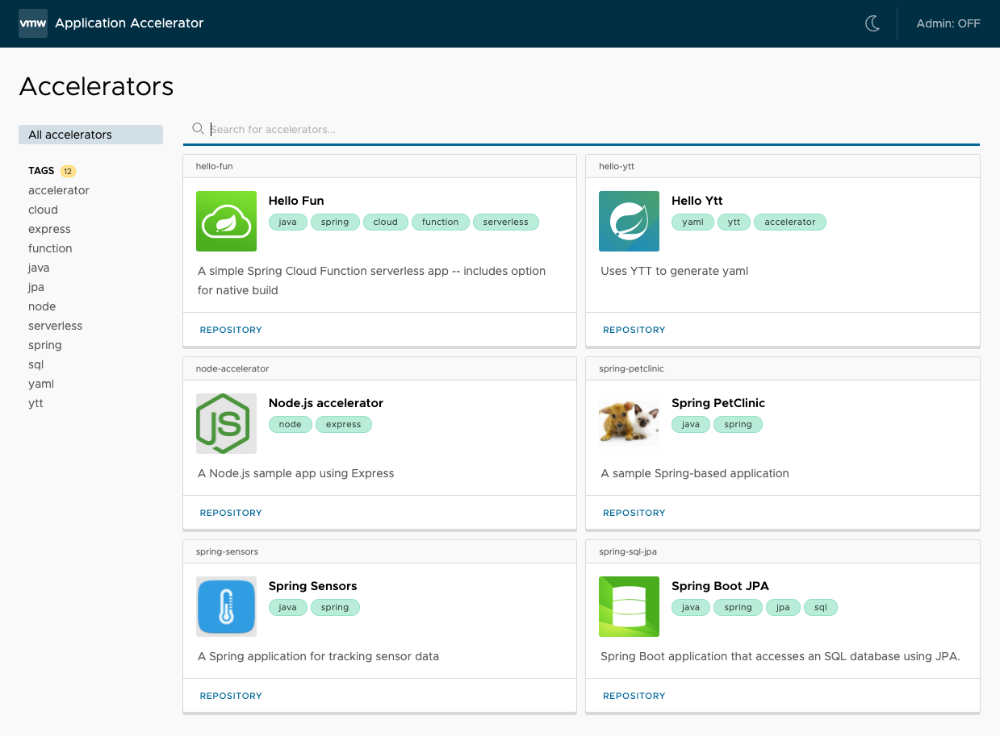
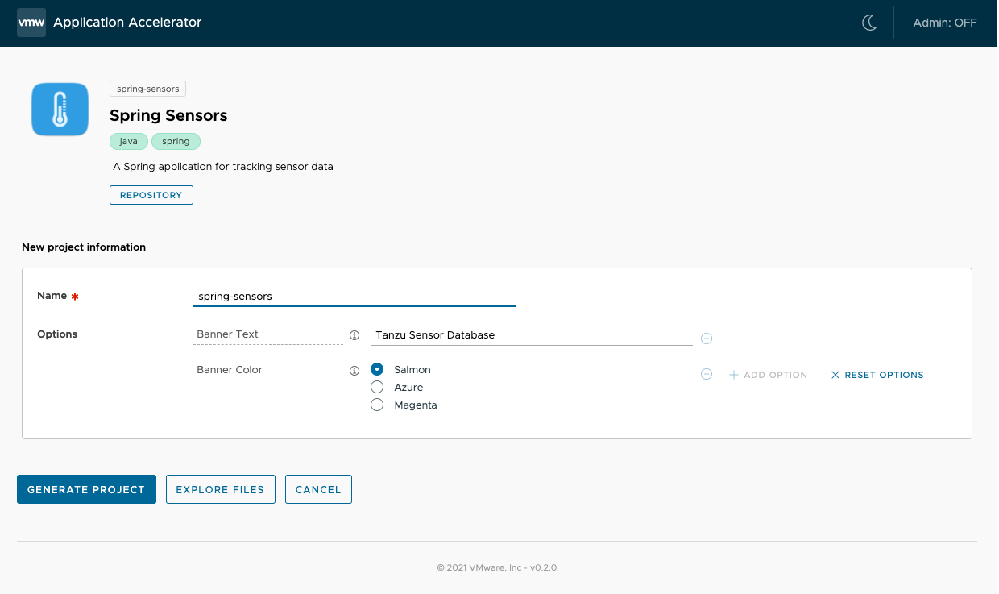

**Application Accelerator for Vmware Tanzu** is made to simplify the creation, discovery, and provisioning of projects and project tempates in enterprise software development.

* Enterprise Architects use Application Accelerator to provide developers and operators in their organization with enterprise-compliant templates for code and configurations.

* Developers use Application Accelerator to create or access projects which follow enterprise standards.

* Operators use Application Accelerator to create and manage platform and supply chain configurations.

If you are familiar with the [Spring Boot Initializr](https://start.spring.io/) experience, Application Accelerator is very similar.

Let's open the Application Accelerator home page for our enterprise.

```dashboard:create-dashboard
name: Accelerator
url: https://accelerator.amer.end2end.link
```

When the page loads, you should see a layout similar to the following:



As you can see, this enterprise has a variety of accelerators available for project ranging from Spring Cloud Functions to Node.js to templates to generate new accelerators. A developer that was building a new go application may select the Go accelerator. 

App Accelerator allows the developer to customize and then download all of the necessary files. For this demo, because we'll be deploying the Spring Sensors app, we want to select the **Spring Sensors** card from the user interface. We should have a similar screen displayed:



Application Accelerator provides powerful features for finding, exploring, and customizing project templates. Users can explore a project's structure, open any of the text files in that project, and even edit configuration values before downloading the project. This is enabled by the ```Explore Files``` feature.

```Click on the Explore Workspaces button towards the bottom of the page```

Let's now view the workspace.yaml file in the Spring Sensors project.

```Double click on arrow to the left of the 'config' folder and open the Workspaces.yaml file found there```

This file is the core TAP workload configuration file for the project, and is used by developers to define the parameters by which TAP and Kubernetes should deploy and operate the application. Some specific items to note here:

* The ```spec``` section contains configuration used to build, deploy, and run the application.
* The ```metadata``` section contains tags used to [[[???]]]

Two tags are important here:

* The ```spec.git.url``` tag is configured to point to the git repository containing the project code
* The ```app.tanzu.vmware.com/workload-type``` metadata label refers to the supply chain to be executed to build and deploy this project

We are not going to change any of this data for the demo, so let's use the command line to download the supply chain accelerator.

```execute
curl acc-ui-server.accelerator-system/api/accelerators/zip?name=spring-sensors -H 'Content-Type: application/json' -d '{"options":{"projectName":"spring-sensors","bannerText":"Tanzu Sensor Database","bannerColor":"Salmon"}}' -o spring-sensors.zip
```

Unzip the repo into your local file system:

```execute
unzip -o spring-sensors.zip && envsubst < spring-sensors/config/workload.yaml > spring-sensors/config/tmp.yaml && mv spring-sensors/config/tmp.yaml spring-sensors/config/workload.yaml
```

Commit the configured application to Git, where it can be picked up by the Supply Chain Choreographer:

```execute
git -C ~/spring-sensors add ~/spring-sensors/
```

```execute
git -C ~/spring-sensors commit -a -m "Initial Commit of Spring Sensors"
```

```execute
git -C ~/spring-sensors push -u origin main
```

Now let's add the workload to the TAP supply chain automation.

```execute
tanzu apps workload create spring-sensors -f spring-sensors/config/workload.yaml -y
```

We can now see our workload among the workloads that TAP is monitoring.


Notice, however, that nothing actually runs or happens - the workload gets stuck in an unknown state! The reason is that our App Operator hasn't yet applied a supply chain, or the steps that our application must undergo to the cluster yet.

So, let's move to adding a TAP supply chain, and building and packaging our application.
